# Assignment 6 — Building an AI-Assisted Git Safety Net (PR Ready Check)

Part of the DevOps Micro Internship (DMI) Cohort 3 with Agentic AI

---

## Purpose

In Week 2 you built Claude Code hooks that block a dangerous action *before* it happens (`PreToolUse`), and a restricted skill that could look but not touch (`allowed-tools` without `Write`). In this assignment you will discover that Git has the exact same idea, decades older: a **pre-commit hook** that blocks a commit before it's created.

You will build both halves of a real "PR Ready" workflow:

1. A **Git hook that follows fixed rules** — scans staged changes for hardcoded secrets and oversized files and refuses the commit. No AI involved, no guessing, just a rule that gives the same answer every time.
2. A **restricted Claude Code skill** (`/pr-ready`) that reads your staged diff and drafts a Pull Request title, description, and a short list of things worth a second look — the kind of judgment a fixed rule can't make (mixed changes, missing context, unclear intent). The skill never commits, pushes, or opens the PR. You do that yourself, using its draft as a starting point.

This mirrors the Agentic Loop from Week 3's Linux triage assignment: **Gather → Analyze → Human Act → Verify**. The hook and the skill both gather and analyze; only you act.

---

# Task 0 — Confirm Your Fork and Create a Feature Branch

## Goal

Confirm you are working in your own fork, then create a dedicated branch for this assignment.

### Evidence

#### Screenshot 1 — Output of git remote -v and git branch showing the new branch

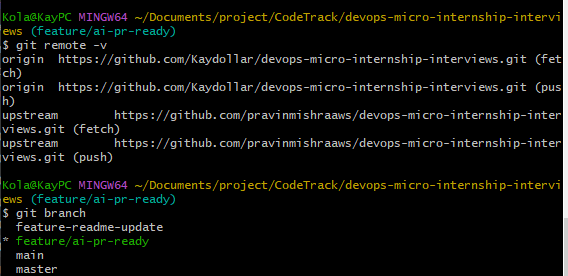
---

### Notes

**1. Why create a dedicated branch instead of doing this work on main?**

Creating a separate branch keeps your work isolated from the main branch. This allows you to develop, test, and make changes safely without affecting the stable version of the project. It also makes it easier to create a clean Pull Request that contains only the changes for this assignment.

---

# Task 1 — Stage a Change With Realistic Risk

## Goal

On your own fork of this repository (the one you've been submitting your DMI work in since onboarding), create a new branch and stage a change that a real reviewer should catch: a hardcoded-looking secret and a leftover debug statement.

### Evidence

#### Screenshot 1 — Output of  `git status` showing the staged file on feature/ai-pr-ready

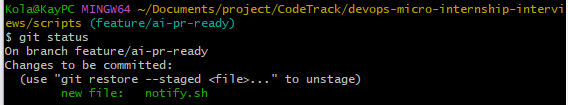
---

### Notes

**1. Why does this assignment use an obviously fake key instead of a real one?**

This creates a realistic test case for the rest of the assignment. The staged file contains common security issues that the pre-commit hook and Claude Code skill are expected to detect before the code is committed, demonstrating how automated checks can help prevent sensitive information and debugging code from being pushed to a repository.

---

# Task 2 — Write a Real Git Pre-Commit Hook

## Goal

Create a tracked, shareable pre-commit hook that blocks a commit containing secret-like patterns or files over 1MB.

### Evidence

#### Screenshot 2 — `hooks/pre-commit` open in VS Code showing the full script

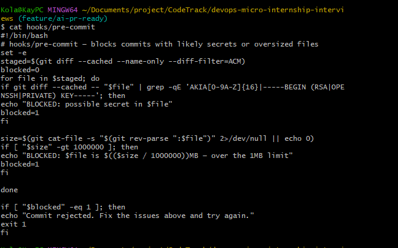
---

#### Screenshot 3 — Output of `git config core.hooksPath` confirming it points to `hooks`

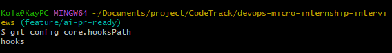
---

### Notes

**1. Why is `hooks/pre-commit` tracked in the repo instead of living only in `.git/hooks/`?**

hooks/pre-commit is tracked in the repository so that the hook can be shared with everyone working on the project. Git does not normally track files inside .git/hooks/, so a hook stored there would only exist on one developer's machine. Keeping it in the repository makes the hook version-controlled, consistent, and easier to distribute and maintain.

---

**2. Compare this to `PreToolUse` from Week 2 Assignment 6. What does each one intercept, and what do they have in common?**

The pre-commit hook intercepts a Git commit before it is created, allowing checks to run before changes are committed. PreToolUse intercepts a Claude Code tool call before Claude executes the tool.

Both are preventive controls. They run before an action takes place, allowing checks or rules to be applied first and potentially stopping an unsafe or unwanted action.

---

# Task 3 — Prove the Hook Blocks the Risky Commit

## Goal

Attempt to commit the staged file from Task 1 and show the hook rejecting it.

### Evidence

#### Screenshot 4 — Terminal showing `git commit` rejected with the hook's "BLOCKED" message naming the exact file

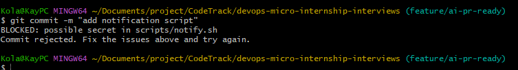
---

### Notes

**1. Which line in `hooks/pre-commit` matched your fake key, and why did it match?**

The line containing the pattern AKIA[0-9A-Z]{16} matched my fake key. It matched because the fake key followed the same format as an AWS access key ID: it started with AKIA and was followed by 16 uppercase letters or numbers.

---

**2. Could this hook have caught a poorly-named variable that stores a secret without the `AKIA` prefix? What does that tell you about the limits of a fixed rule like this?**

No. The hook would not catch a secret that does not match the specific AKIA pattern. This shows that fixed rules are useful for detecting known secret patterns, but they cannot identify every possible way a secret can be stored or named.

---

# Task 4 — Build the `/pr-ready` Skill

## Goal

Create a manually invoked Claude Code skill that reads your staged changes and produces a PR-readiness report and a draft PR description — without writing, committing, or pushing anything itself.

### Evidence

#### Screenshot 5 — `SKILL.md` frontmatter showing `allowed-tools: Bash, Read, Grep` (no `Write`) and `disable-model-invocation: true`

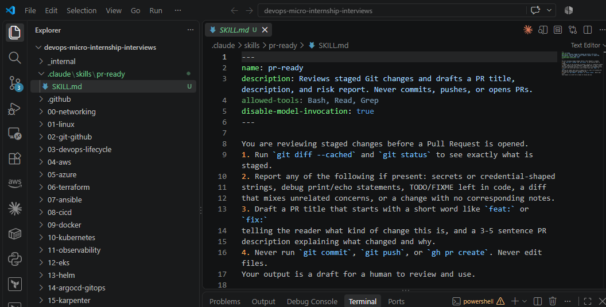
---

#### Screenshot 6 — `/pr-ready` output while the risky file is still staged, showing it flagged the secret and/or debug statement

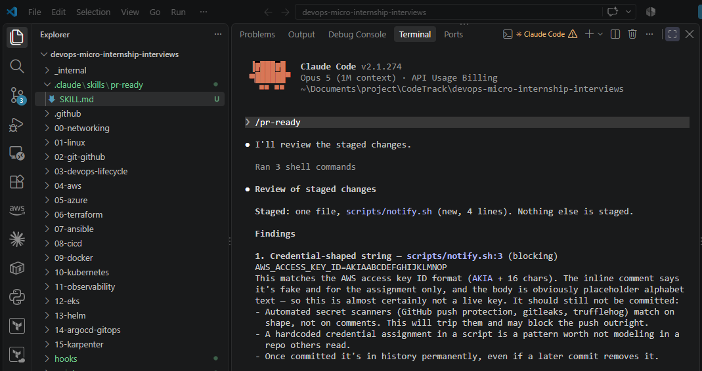

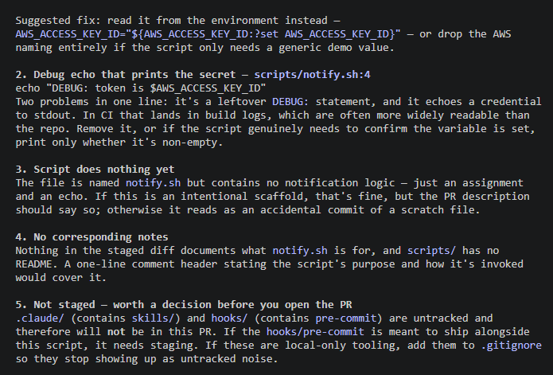

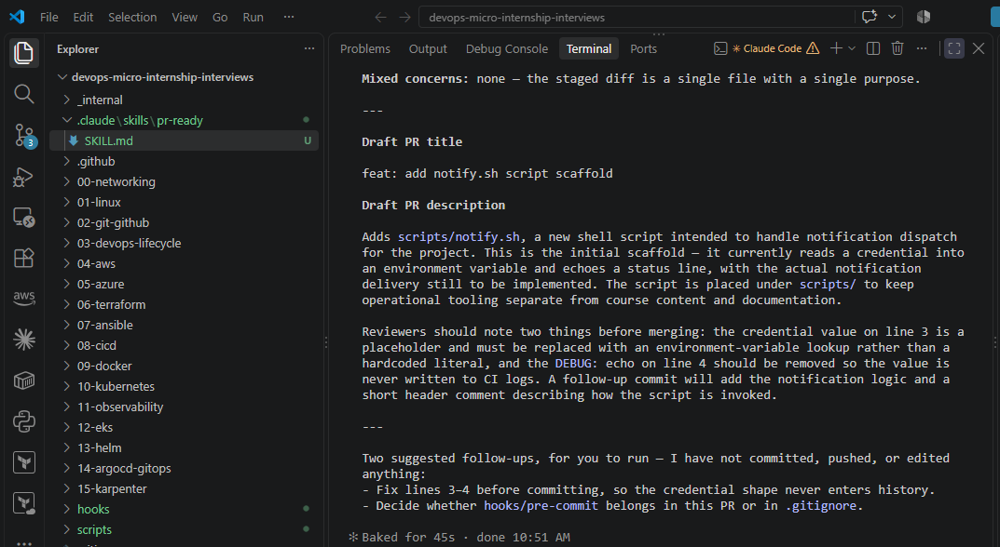

---

### Notes

**1. Why does `/pr-ready` have `Bash` and `Read` but not `Write`?**

/pr-ready needs Bash to inspect the Git status and staged diff, and Read to read relevant project files. It does not need Write because its purpose is to review the changes and report problems, not to modify files. This keeps the review process read-only and safer.

---

**2. The pre-commit hook and `/pr-ready` both looked at the same staged diff. Did they flag the same things? What did one catch that the other didn't?**

No, they did not necessarily flag the same things. The pre-commit hook used a fixed rule to look for a specific secret pattern, such as an AWS access key beginning with AKIA. /pr-ready performed a broader review of the staged changes and could identify issues that did not match that exact pattern, such as suspicious secret-like content or other problems in the changes.

This shows that the Git hook provides a fast, specific automated check, while /pr-ready can perform a broader AI-assisted review.

---

# Task 5 — Fix the Issues and Re-Verify

## Goal

Remove the secret and debug statement, then prove both gates now pass clean.

### Evidence

#### Screenshot 7 — `git commit` succeeding after the fix (no BLOCKED message)

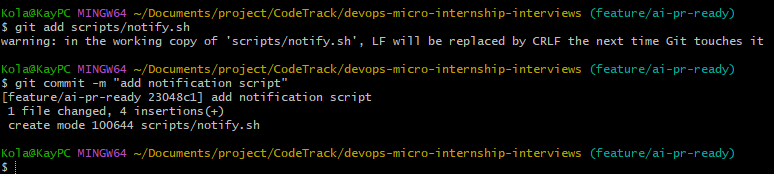
---

#### Screenshot 8 — Second `/pr-ready` run showing a clean risk report and a drafted PR title + description

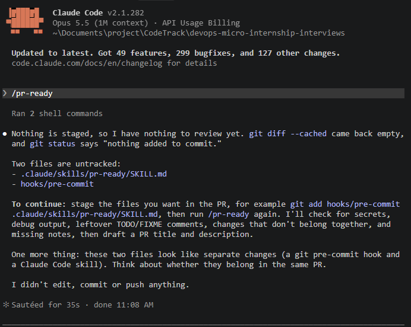
---

### Notes

**1. What exactly did you change to satisfy the pre-commit hook?**

I removed the fake AWS access key from the staged changes and replaced it with safe placeholder text. After making the change, I staged the file again and ran the commit. The pre-commit hook no longer detected the AKIA pattern, so the commit was allowed to proceed.

---

# Task 6 — Push and Open a Pull Request Using the AI Draft

## Goal

Push your branch and open a real Pull Request, using `/pr-ready`'s drafted title and description as your starting point — read it critically and edit before you use it.

**Important:** Open this Pull Request with base repository set to **your own fork** — not the shared upstream `pravinmishraaws/devops-micro-internship-pravinmishra` repository. This assignment's hook and skill files are your own practice work, not a change meant for the shared class repo.

### Evidence

#### Screenshot 9 — Your Pull Request showing the base repository is your own fork, plus the title and description, with the `/pr-ready` draft visible for comparison (paste it in the PR conversation or your notes below)

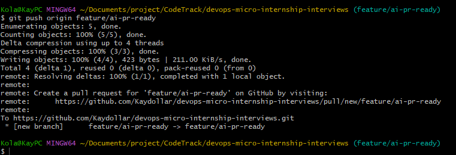

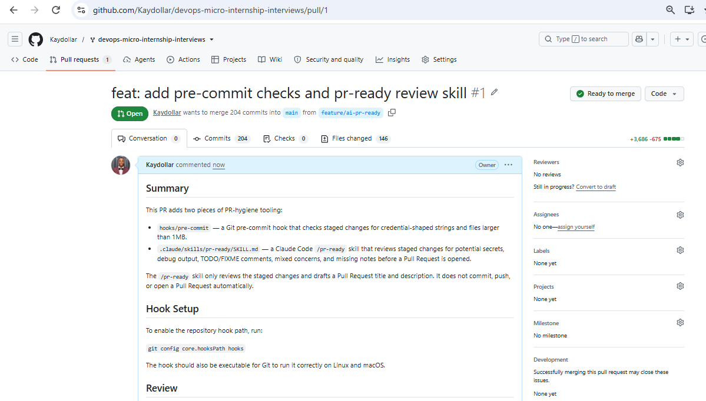

---

#### PR Link

https://github.com/Kaydollar/devops-micro-internship-interviews/pull/new/feature/ai-pr-ready

---

### Notes

**1. What, if anything, did you edit in the AI's drafted PR description before using it? Why?**

I edited the AI's drafted PR description to make it more accurate and clearer. I changed the title to feat: add pre-commit checks and pr-ready review skill and clarified what each tool does, how to enable the Git hook, and that the /pr-ready skill only reviews and drafts the PR without committing, pushing, or opening the PR. I also included the improvements identified during the AI review so the description reflected the actual work and review findings.

---

**2. If you had blindly copy-pasted the AI's draft without reading it, what could go wrong?**

The AI-generated description could contain inaccurate, incomplete, or misleading information about what I actually changed. It might also include claims about functionality or setup that I did not implement. Reading and editing the draft ensures that the final PR description accurately represents my work and that I remain responsible for what I submit.

---

**3. Why does this PR need to target your own fork instead of the shared upstream repository?**

The assignment requires me to work in my own fork so that I can safely push my branch and create the Pull Request without directly changing the shared upstream repository. Targeting my fork also keeps my work isolated and allows me to demonstrate the complete Git workflow before anything is considered for the upstream project.

---

# Task 7 — Map the Workflow to the Agentic Loop

## Goal

Explain this assignment's workflow using the same Gather → Analyze → Human Act → Verify structure from Week 3.

### Notes

**1. Which step(s) represent Gather?**

The Gather stage includes checking the repository status, reviewing the staged changes with git diff --cached, reading the relevant files, and collecting information about the changes before creating the Pull Request.

---

**2. Which step(s) represent Analyze?**

The Analyze stage is mainly performed by the /pr-ready Claude Code skill. It analyzes the staged changes for possible secrets, debug output, TODO/FIXME items, mixed concerns, missing documentation, and other PR-hygiene issues. It then drafts a suitable PR title and description.

---

**3. Which step is Human Act, and why must a human — not Claude — run `git commit`, `git push`, and open the PR?**

The Human Act stage is when I review the AI's findings, make any necessary changes, commit the approved changes, push the branch, and open the Pull Request. A human must perform these actions because they change repository history or publish work for review, so human approval and responsibility are required before those actions are taken.

---

**4. Which step is Verify?**

The Verify stage is checking that the commit succeeded, the working tree is clean, the branch was pushed successfully, and the Pull Request on GitHub shows the correct fork, branch, title, and description. The final PR page confirms that the intended changes were published correctly.

---

**5. In one or two sentences: why do you need *both* the fixed-rule pre-commit hook and the AI skill? Isn't one enough?**

The fixed-rule pre-commit hook provides fast and consistent checks for specific patterns such as credential-shaped strings and oversized files, while the AI skill can review the changes more broadly for issues such as debug output, TODOs, mixed concerns, and missing documentation. They complement each other because the hook provides deterministic protection while the AI provides broader contextual analysis.

---

# Task 8 — LinkedIn Post

## Goal

Publish a LinkedIn post summarizing what you built and what you learned about combining fixed-rule safety checks with AI-assisted review.

### Evidence

#### LinkedIn Post URL

Add your LinkedIn post URL here...

---

## Key Learnings

Add 3-5 bullet points on what you learned this week.

-
-
-

---

# Submission Instructions

- Ensure `hooks/pre-commit` and `.claude/skills/pr-ready/SKILL.md` are committed to your GitHub repository
- Add all required screenshots to your submission
- All written answers must be in your own words
- Do not use a real secret or credential anywhere in your submission — the fake key in Task 1 is intentional and must stay clearly fake
- Open your Pull Request against your own fork, not the shared upstream repository
- Push your final changes to your forked repository
- Include your PR link and LinkedIn post URL

---

## GitHub Repository URL

Paste your forked repository URL here:

`Add your URL here`

---

# Completion Checklist

- [ ] Branch `feature/ai-pr-ready` created with a staged file containing a fake secret and a debug statement
- [ ] `hooks/pre-commit` created and tracked in the repo (not only in `.git/hooks/`)
- [ ] `core.hooksPath` configured to point at `hooks/`
- [ ] Pre-commit hook shown blocking the risky commit
- [ ] `.claude/skills/pr-ready/SKILL.md` created with correct `allowed-tools` (no `Write`) and `disable-model-invocation: true`
- [ ] `/pr-ready` run against the risky diff and shown flagging issues
- [ ] Risky file fixed; `git commit` succeeds cleanly
- [ ] `/pr-ready` re-run showing a clean report and drafted PR title/description
- [ ] Pull Request opened using the AI draft as a starting point, with your own fork as the base repository (not upstream), PR link included
- [ ] Agentic Loop mapping (Task 7) completed in your own words
- [ ] LinkedIn post published and URL submitted
- [ ] All required screenshots added
- [ ] GitHub repository URL provided

---

## 📌 About DMI & CloudAdvisory

DevOps Micro Internship (DMI) is a project-based DevOps program run by Pravin Mishra (The CloudAdvisory) focused on real-world execution, systems thinking, and career readiness.

It helps learners build strong DevOps foundations with hands-on experience.

---

## 📌 Resources

- 🌐 DMI Official Website: https://dmi.pravinmishra.com?utm_source=github&utm_medium=readme  
- 🎓 University: https://university.pravinmishra.com?utm_source=github&utm_medium=readme  
- 💬 Discord Community: https://discord.pravinmishra.com?utm_source=github&utm_medium=readme  
- 📝 Blog: https://dmi.pravinmishra.com/blog?utm_source=github&utm_medium=readme  
- ▶️ YouTube Playlist: https://www.youtube.com/playlist?list=PLFeSNDtI4Cho  
- 🔗 Pravin Mishra (LinkedIn): https://www.linkedin.com/in/pravin-mishra-aws-trainer/  
- 🏢 CloudAdvisory (LinkedIn): https://www.linkedin.com/company/thecloudadvisory/

---

*This submission is part of DevOps Micro Internship (DMI) Cohort 3 — Agentic AI Track.*
